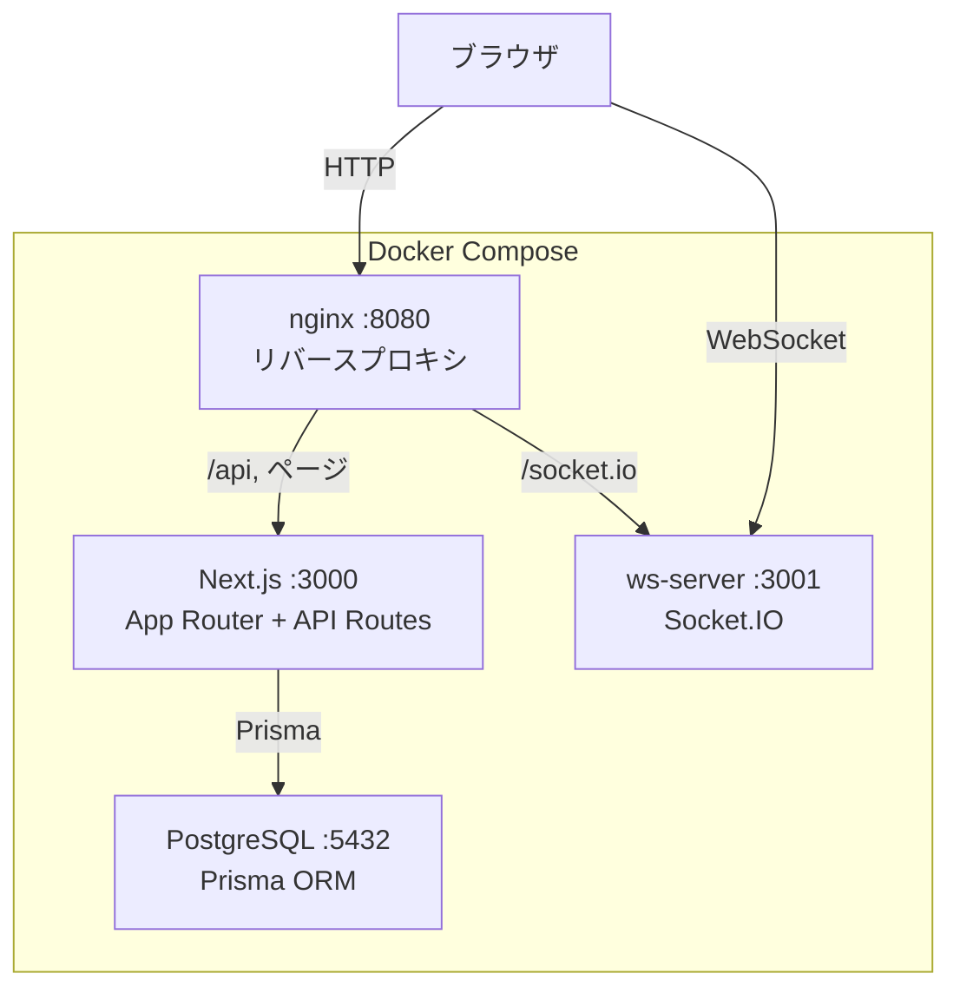
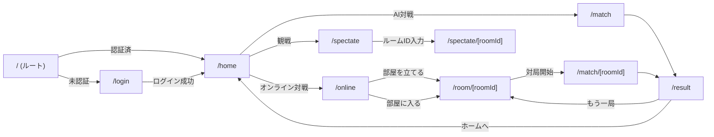
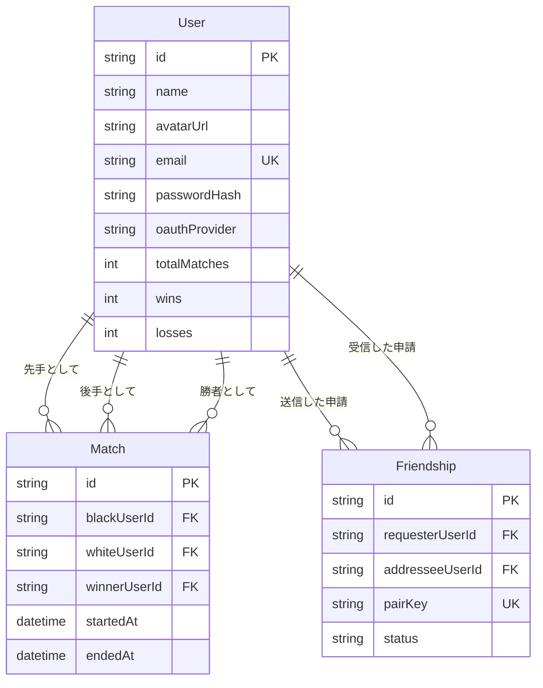

# 🐯 将棋ゲーム（Tora-sen）— フロントエンド完全解説

## 1. 全体アーキテクチャ



| レイヤー | 技術 |
|----------|------|
| フレームワーク | **Next.js 14** (App Router) + TypeScript |
| スタイリング | Vanilla CSS（`globals.css` + `wafuu-theme.css` + `login.css`） |
| 認証 | JWT (httpOnly Cookie) + argon2 |
| リアルタイム通信 | Socket.IO (`socket.io-client`) |
| DB | PostgreSQL + Prisma ORM |
| バリデーション | Zod |
| ビルド | `output: "standalone"` (Docker最適化) |

---

## 2. ディレクトリ構造（フロント関連のみ）

```
nextjs/
├── app/
│   ├── layout.tsx           ← ルートレイアウト
│   ├── globals.css          ← 基本デザインシステム
│   ├── wafuu-theme.css      ← 和風テーマ共通CSS
│   ├── login/
│   │   ├── page.tsx         ← ログイン/新規登録画面
│   │   └── login.css        ← login専用CSS
│   ├── home/page.tsx        ← ホーム画面（メインメニュー）
│   ├── online/page.tsx      ← オンライン対戦ロビー
│   ├── room/[roomId]/page.tsx  ← ルーム待機画面
│   ├── match/
│   │   ├── page.tsx         ← AI対戦（ローカル）
│   │   └── [roomId]/page.tsx   ← オンライン対戦
│   ├── spectate/
│   │   ├── page.tsx         ← 観戦入口
│   │   └── [roomId]/page.tsx   ← 観戦画面（準備中）
│   ├── result/page.tsx      ← 結果画面
│   └── api/                 ← APIルート（後述）
├── components/
│   └── MatchBoard.tsx       ← 将棋盤コンポーネント（メイン）
├── lib/
│   ├── auth.ts              ← JWT認証ユーティリティ
│   ├── prisma.ts            ← Prismaクライアント
│   └── validations.ts       ← Zodスキーマ
├── middleware.ts            ← 認証ミドルウェア
├── package.json
├── tsconfig.json
└── prisma/schema.prisma     ← DBスキーマ
```

---

## 3. ページフロー（ユーザー導線）



---

## 4. 各ファイル詳細解説

### 4.1 `layout.tsx` — ルートレイアウト

全ページに適用される最上位コンポーネント。

- `globals.css` と `wafuu-theme.css` をインポート
- `<html lang="ja">` で日本語設定
- `metadata.title = "将棋ゲーム"`

> [!NOTE]
> 全ページに共通のヘッダーやフッターはここではなく、各ページコンポーネント内で個別に定義されている。

---

### 4.2 `middleware.ts` — 認証ミドルウェア

**Next.js Edge Middleware** がリクエストごとに実行される。JWT (`jose`) でCookieのトークンを検証。

| ルート | 未認証時 | 認証済時 |
|--------|----------|----------|
| `/` | → `/login` | → `/home` |
| `/login` | そのまま表示 | → `/home` |
| `/home`, `/online`, `/room/*`, `/match/*`, `/spectate/*`, `/result` | → `/login` | そのまま表示 |

**重要ポイント:**
- Cookie名: `torassen_token`
- `PROTECTED_PATHS` に保護対象パスを定義
- `AUTH_PAGES` に認証済みユーザーがアクセス不要なパスを定義

---

### 4.3 `/login` — ログイン/新規登録画面

**Client Component** (`"use client"`)

**状態管理:**

| state | 型 | 用途 |
|-------|-----|------|
| `mode` | `"login" \| "signup"` | タブ切り替え |
| `email` | `string` | メールアドレス入力 |
| `password` | `string` | パスワード入力 |
| `name` | `string` | 表示名入力（signup時のみ） |
| `error` | `string` | エラーメッセージ |
| `loading` | `boolean` | 送信中フラグ |

**処理フロー:**
1. フォームsubmit → `handleSubmit`
2. `mode` に応じて `/api/auth/signup` or `/api/auth/login` に `POST`
3. 成功 → `router.push("/home")` + `router.refresh()`
4. 失敗 → エラーメッセージ表示

**CSS:** `login.css` — 独自の背景画像（`/images/login-bg.png`）、ダークオーバーレイ、ゴールドアクセントのカード

---

### 4.4 `/home` — ホーム画面

**ユーザー情報の取得:**
- `useEffect` で `/api/me` を `fetch` → `User` をstateに保存
- ヘッダーにユーザー名表示

**メニュー項目:**

| ラベル | リンク先 | 説明 |
|--------|----------|------|
| オンライン対戦 | `/online` | ルーム作成して友達と対戦 |
| AI対戦 | `/match` | コンピュータと練習（準備中） |
| 観戦する | `/spectate` | 他プレイヤーの対局を見る |

**ログアウト:** `/api/auth/logout` に `POST` → `/login` へリダイレクト

---

### 4.5 `/online` — オンラインロビー

**2つのモード:**

| mode | 表示 |
|------|------|
| `"select"` | 「部屋を立てる」「部屋に入る」の選択画面 |
| `"join"` | ルームID入力フォーム |

**部屋を立てる:**
- `generateRoomId()` でランダム6文字のルームIDを生成
  - 使用文字: `ABCDEFGHJKLMNPQRSTUVWXYZ23456789`（紛らわしいI,O,0,1を除外）
- `/room/[roomId]?host=true` へ遷移

**部屋に入る:**
- ルームID入力 → `/room/[roomId]` へ遷移（`host`パラメータなし）

---

### 4.6 `/room/[roomId]` — ルーム待機画面

**最も複雑なページの一つ。WebSocket接続を行う。**

**状態管理:**

| state | 用途 |
|-------|------|
| `socket` | Socket.IOインスタンス |
| `roomState` | サーバーから受信したルーム状態 |
| `mySocketId` | 自分のSocket ID |
| `userId` | `/api/me` から取得したユーザーID |
| `copied` | ルームIDコピー完了フラグ |

**WebSocket接続フロー:**
1. `io("http://localhost:3001")` で接続
2. `connect` イベント → `joinRoom` をemit
3. `roomState` イベントで部屋の状態を受信（プレイヤー一覧など）
4. `gameStart` イベント → `/match/[roomId]` へ遷移

**UI要素:**
- ルームIDの大きな表示 + コピーボタン
- プレイヤーアイコン（参加者はアイコン、空席は `?` マーク）
- ステータスメッセージ（「相手の参加を待っています…」「2人揃いました！」）
- ホストのみ「対局を始める」ボタン表示（2人揃うまで `disabled`）

> [!IMPORTANT]
> WebSocket接続先が `http://localhost:3001` にハードコードされている。本番環境では環境変数化が必要。

---

### 4.7 `/match` と `/match/[roomId]` — 対局画面

**2つの入口:**

| パス | 用途 | WebSocket |
|------|------|-----------|
| `/match` | AI対戦（ローカル） | なし |
| `/match/[roomId]` | オンライン対戦 | あり |

`/match/[roomId]` では:
1. WebSocket接続 → `joinRoom` emit
2. `roomState` から自分が先手(`sente`) or 後手(`gote`) を判定
3. `MatchBoard` に `socket`, `wsStatus`, `mySide` をpropsとして渡す

---

### 4.8 `MatchBoard.tsx` — 将棋盤コンポーネント（最重要）

**5×5将棋の中核コンポーネント。**

**初期盤面 `INITIAL_BOARD`:**
```
行0 (後手の最奥): 飛 角 銀 金 王
行1 (後手の歩):   ・ ・ ・ ・ 歩
行2 (中央):       ・ ・ ・ ・ ・
行3 (先手の歩):   歩 ・ ・ ・ ・
行4 (先手の最奥): 王 金 銀 角 飛
```

**Props:**

| prop | 型 | 説明 |
|------|-----|------|
| `roomId` | `string?` | オンライン対戦時のルームID |
| `socket` | `Socket?` | Socket.IOインスタンス |
| `wsStatus` | `string` | 接続状態 |
| `mySide` | `"sente" \| "gote"` | 自分の先後 |

**盤面操作ロジック (`handleCellClick`):**
1. 自分のターンでなければ無視
2. 駒を選択 → 選択済みの駒をクリック → 選択変更
3. 空マスまたは相手の駒をクリック → 移動実行
4. WebSocket接続時は `socket.emit("move", { roomId, from, to })` で送信

**相手の手の受信:**
- `socket.on("moveMade", ...)` で盤面を更新 + ターン変更

> [!WARNING]
> 現状、移動バリデーション（合法手チェック）は実装されていない。どこにでも移動可能。持ち駒・成りの機能もない。

---

### 4.9 `/spectate` と `/spectate/[roomId]` — 観戦機能

- `/spectate`: ルームID入力フォーム
- `/spectate/[roomId]`: 「準備中です」のプレースホルダー

---

### 4.10 `/result` — 結果画面

クエリパラメータ `roomId` を受け取る。

**現状はダミーデータ:**
- `isWin = true` (常に勝利表示)
- `reason = "王を取りました"`

**ボタン:**
- 「もう一局」（`roomId`がある場合のみ表示）→ `/room/[roomId]?host=true`
- 「← 戻る」→ `/home`

---

## 5. CSSアーキテクチャ

### 3つのCSS層

| ファイル | 用途 | 読み込み元 |
|----------|------|-----------|
| [globals.css](file:///Users/kotasakatsume/cursur/ft_tra/nextjs/app/globals.css) | 基本デザインシステム（明るいテーマ） | `layout.tsx` |
| [wafuu-theme.css](file:///Users/kotasakatsume/cursur/ft_tra/nextjs/app/wafuu-theme.css) | 和風ダークテーマ（実際に使用中） | `layout.tsx` |
| [login.css](file:///Users/kotasakatsume/cursur/ft_tra/nextjs/app/login/login.css) | ログイン画面専用 | `login/page.tsx` |

> [!NOTE]
> `globals.css` は初期の明るいテーマ用で、`wafuu-` 接頭辞のクラスが現在のメインテーマ。ほとんどのページは `wafuu-*` クラスを使用している。

### 和風テーマのデザイントークン

| 要素 | 値 |
|------|-----|
| 背景色 | `rgba(10, 10, 20, ...)` (超ダーク) |
| アクセント色 | `#d4af37` (ゴールド) |
| テキスト色 | `#f5e6c8` (クリーム) |
| フォント | M PLUS Rounded 1c / Noto Sans JP |
| エフェクト | `backdrop-filter: blur()`, `text-shadow`, グラデーション |

### 主要CSSクラス（`wafuu-theme.css`）

| クラス名 | 用途 |
|----------|------|
| `.wafuu-page` | ページ全体のコンテナ |
| `.wafuu-bg` | 背景画像（固定、オーバーレイ付き） |
| `.wafuu-header` | ヘッダーバー |
| `.wafuu-content` | メインコンテンツ領域 |
| `.wafuu-card` | カードUI |
| `.wafuu-menu-item` | メニューリスト項目 |
| `.wafuu-btn-primary` | ゴールドグラデーションボタン |
| `.wafuu-btn-secondary` | セカンダリボタン |
| `.wafuu-btn-outline` | アウトラインボタン |
| `.wafuu-input` | テキスト入力 |
| `.wafuu-error` | エラー表示 |
| `.wafuu-badge` | ステータスバッジ |
| `.wafuu-pulse` | パルスアニメーション |

---

## 6. lib/ — ユーティリティ

### 6.1 `auth.ts`

| 関数 | 用途 |
|------|------|
| `signToken(payload)` | JWTトークンを生成（HS256, 7日有効） |
| `verifyToken(token)` | トークンを検証 |
| `setAuthCookie(payload)` | httpOnly Cookieにトークンをセット |
| `getAuthFromCookie()` | Cookieからトークンを取得・検証 |
| `clearAuthCookie()` | Cookieを削除 |

### 6.2 `validations.ts`

Zodスキーマで入力バリデーション:
- `signupSchema`: email + password(8文字以上) + name(1-50文字)
- `loginSchema`: email + password

### 6.3 `prisma.ts`

Prismaクライアントのシングルトン。開発環境ではグローバル変数にキャッシュしてHMRでの再生成を防止。

---

## 7. APIエンドポイント（フロントが叩く先）

| メソッド | パス | フロントでの使用箇所 |
|----------|------|---------------------|
| `POST` | `/api/auth/signup` | `login/page.tsx` — 新規登録 |
| `POST` | `/api/auth/login` | `login/page.tsx` — ログイン |
| `POST` | `/api/auth/logout` | `home/page.tsx` — ログアウト |
| `GET` | `/api/me` | `home/page.tsx`, `room/[roomId]/page.tsx` — ユーザー情報取得 |

---

## 8. WebSocketイベント（フロントが使用するもの）

| イベント | 方向 | 使用ページ | 用途 |
|----------|------|-----------|------|
| `joinRoom` | Client→Server | `room/[roomId]`, `match/[roomId]` | ルーム参加 |
| `hostStart` | Client→Server | `room/[roomId]` | ホストがゲーム開始 |
| `move` | Client→Server | `MatchBoard` | 駒の移動送信 |
| `roomState` | Server→Client | `room/[roomId]`, `match/[roomId]` | ルーム状態受信 |
| `gameStart` | Server→Client | `room/[roomId]` | ゲーム開始通知 |
| `moveMade` | Server→Client | `MatchBoard` | 相手の移動受信 |
| `playerLeft` | Server→Client | `room/[roomId]` | プレイヤー退室通知 |

---

## 9. Prisma DBスキーマ



---

## 10. 未実装・今後必要な作業

| 項目 | 状態 |
|------|------|
| 将棋ルールエンジン（合法手チェック） | ❌ 未実装 |
| 持ち駒システム | ❌ 未実装 |
| 成り（プロモーション） | ❌ 未実装 |
| AI対戦ロジック | ❌ 未実装 |
| 観戦機能 | ❌ プレースホルダーのみ |
| 結果画面のリアルデータ | ❌ ダミーデータ |
| WebSocket URL の環境変数化 | ❌ ハードコード |
| OAuth (42 / Google) | ❌ 未実装 |
| フレンドシステム | ❌ DBスキーマのみ |
| 戦績表示 | ❌ 未実装 |
